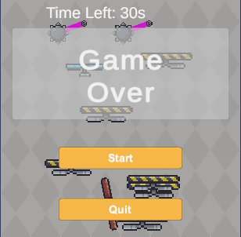
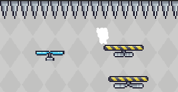
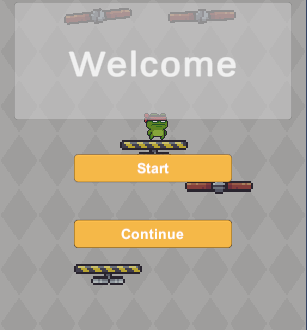

#  SkyEscape - A Vertical Escape Platformer    

SkyEscape is a **fast-paced vertical platformer** where players must escape rising dangers by jumping between platforms, avoiding obstacles, and using special mechanics like wall jumps and fans to survive. As platforms continuously move upwards, the player must climb higher while avoiding deadly spikes and other hazards. With each level, survival time increases, making the challenge even harder.

- Game Engine: **Unity** 
- Programming Language: **C#**

<!-- Bootstrap Carousel -->

  

    

      
    

    

      
    

    

      
    

    

      
    

  

  <a class="carousel-control-prev" href="#imageCarousel" role="button" data-bs-slide="prev">
    
    Previous
  </a>
  <a class="carousel-control-next" href="#imageCarousel" role="button" data-bs-slide="next">
    
    Next
  </a>

<!-- Bootstrap CSS (Include this in your project) -->
<link rel="stylesheet" href="https://cdn.jsdelivr.net/npm/bootstrap@5.3.0/dist/css/bootstrap.min.css">
<!-- Bootstrap JS (Include this in your project) -->

---

## 🎮 **Controls**
| **Action**  | **Key**  |
|------------|---------|
| Move Left  | A / Left Arrow |
| Move Right | D / Right Arrow |
| Jump       | Space *(Not yet implemented fully - needs jump force adjustments and proper air control.)* ⚠️ |
| Wall Jump  | Press Space while touching a wall |

---

## 🎮 **Game Overview**
- **Game Type:** 2D Platformer (Vertical Escape)
- **Objective:** Escape rising dangers by moving left and right while avoiding hazards.
- **Levels:** 5 progressively challenging levels.
- **Winning Condition:** Survive for the required time and reach Level 5.
- **Losing Condition:** Touching spikes or falling off-screen.

---

##  **Future Improvements**
- **Complete the Jump Mechanic** – Fix jump height inconsistencies and improve mid-air control.
- **New Obstacle Types** – Moving spikes, falling hazards.
- **Power-Ups** – Temporary invincibility, double-speed boosts.
- **Sound Effects & Music** – Background music and jump effects.
- **More Levels** – Expand beyond 5 levels with unique mechanics.
- **Multiplayer Mode** – Competitive or cooperative gameplay.

## 📂 **Project Structure**
The project follows a structured file organization to keep assets and scripts well-managed.

 📁 **SkyEscape**
- **`📂 Assets/`** → *Main Unity asset folder (contains all game resources)*
  - **`📂 Animation/`** → *Stores all animations (Player, Platforms, etc.)*
    - **`📂 Platforms/`** → *Animations for platforms*
    - **`📂 Player/`** → *Animations for the player character*
  - **`📂 Materials/`** → *Materials for rendering effects (e.g., `Background.mat`)*
  - **`📂 Prefabs/`** → *Reusable objects (platforms, traps, player, UI elements)*
    - Basic and rotating platforms, spiked balls, fan platforms, etc.
  - **`📂 Scenes/`** → *Contains Unity scene files (game levels, menus, UI screens)*
  - **`📂 Scripts/`** → *All C# scripts responsible for gameplay mechanics*
    - **`AnimationBG.cs`**, **`GameManager.cs`**, **`PlayerController.cs`**, **`Spawner.cs`**, etc.
  - **`📂 Settings/`** → *Stores game settings (Input, Render configurations)*
  - **`📂 TextMeshPro/`** → *Font and text settings for UI elements*
  - **`📂 Pixel Adventure 1/`** → *External assets (Pixel Adventure 1 package)*
    - **`📂 Assets/`**, **`📂 Scenes/`** (*Contains imported package assets*)

- **`📂 Packages/`** → *Stores Unity package dependencies*
- **`📂 ProjectSettings/`** → *Stores Unity project settings (input, physics, rendering, etc.)*
- **`📂 UserSettings/`** → *Editor-specific settings (not essential for version control)*
- **`📂 Library/`** → *Auto-generated Unity cache (**DO NOT COMMIT**)*
- **`📂 Logs/`** → *Debug logs generated by Unity (**Ignore in version control**)*
- **`📄 README.md`** → *Project documentation and setup guide*
- **`📄 .gitignore`** → *Specifies which files should be ignored in version control*

### **📜 Explanation of Each Folder**
| **Folder**          | **Description** |
|---------------------|----------------|
| `SkyEscape/`       | The root directory containing all project files. |
| **`Assets/`**      | The main directory for Unity assets and game resources. |
| `Animation/`       | Stores character animations such as `Run`, `Jump`, `Fall`, and `WallJump`. |
| `Scripts/`         | Contains all C# scripts responsible for gameplay mechanics. |
| `Prefabs/`         | Prefabricated game objects like platforms, traps, and interactive elements. |
| `Sprites/`         | Stores game visuals, including characters, environments, and UI icons. |
| `UI/`              | Holds UI elements such as menus, buttons, and in-game HUD. |
| **`Scenes/`**      | Contains Unity scene files representing different game levels. |
| **`Packages/`**    | Stores dependencies and Unity packages required for the project. |
| **`ProjectSettings/`** | Stores Unity project configurations (physics, lighting, input mappings). |
| **`UserSettings/`** | Contains personal Unity editor settings (not necessary for version control). |
